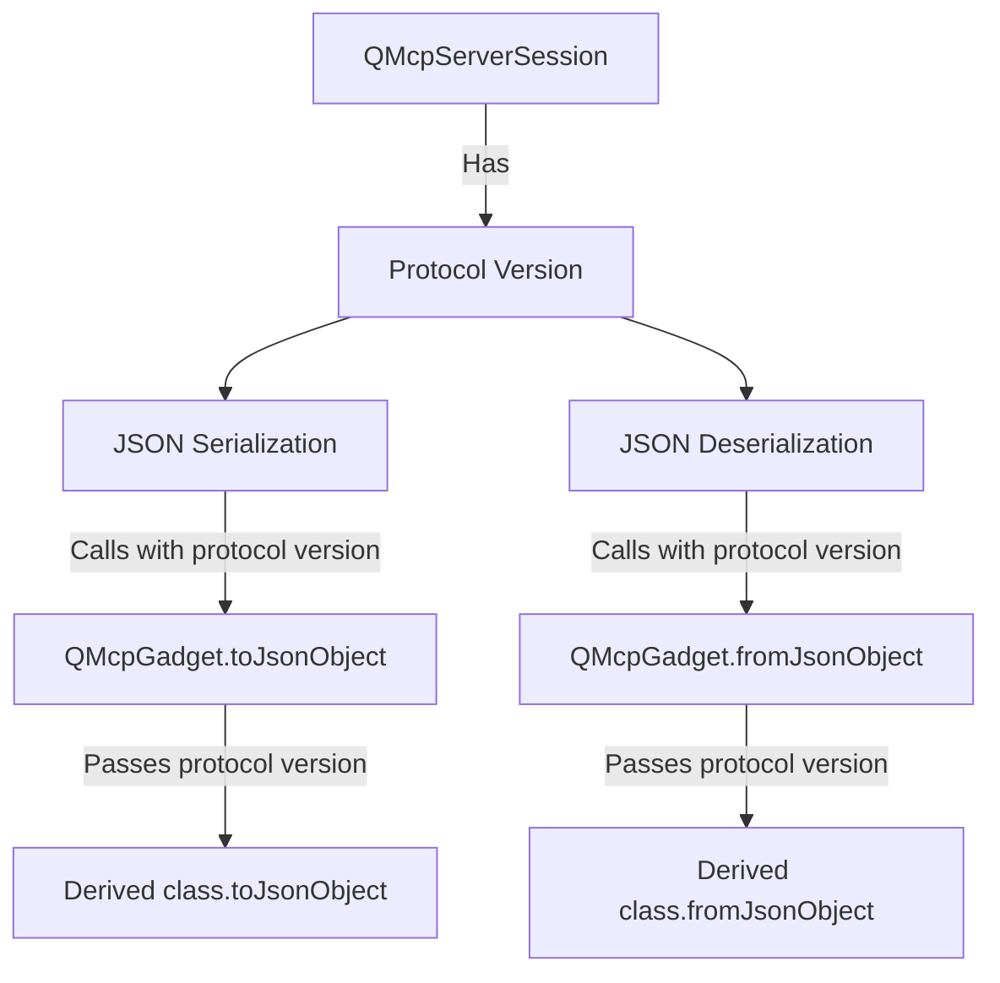

# Protocol Version Parameter Approach for Supporting Multiple MCP Protocol Versions

Based on your feedback, I'll develop a final plan to add the `protocolVersion` parameter directly to `fromJsonObject` and `toJsonObject` methods with a default value, rather than having separate overloaded methods.

## Current Situation Analysis

The issue is that TextContent annotations have different schema representations between protocol versions:

### 2024-11-05 Schema
```json
"annotations": {
    "properties": {
        "audience": { ... },
        "priority": { ... }
    },
    "type": "object"
}
```

### 2025-03-26 Schema
```json
"annotations": {
    "$ref": "#/definitions/Annotations",
    "description": "Optional annotations for the client."
}
```

## Key Challenge

Each QMcpServerSession is tied to a single client connection and has its own negotiated protocol version. The server could have multiple sessions with different clients using different protocol versions simultaneously. Our solution needs to:

1. Track protocol version per session
2. Pass the protocol version through the serialization/deserialization chain
3. Support different annotation formats based on the protocol version being used

## Solution Architecture

This diagram illustrates the solution with the direct parameter passing approach:



## Detailed Implementation Plan

### 1. Add Protocol Version to QMcpServerSession

Update QMcpServerSession to store the protocol version:

```cpp
// In qmcpserversession.h - Private class
class QMcpServerSession::Private
{
public:
    // Existing members...
    QString protocolVersion;
    // ...
};

// In QMcpServerSession - public API
QString protocolVersion() const { return d->protocolVersion; }
```

### 2. Modify the QMcpGadget Class to Support Protocol Version Parameter

Update the QMcpGadget base class to include protocol version in serialization:

```cpp
// In qmcpgadget.h
class Q_MCPCOMMON_EXPORT QMcpGadget
{
public:
    // Modified method with default parameter
    virtual QJsonObject toJsonObject(const QString &protocolVersion = "2025-03-26") const;

    // Modified method with default parameter
    virtual bool fromJsonObject(const QJsonObject &object, const QString &protocolVersion = "2025-03-26");
    
    // Other existing methods...
};
```

```cpp
// In qmcpgadget.cpp
QJsonObject QMcpGadget::toJsonObject(const QString &protocolVersion) const
{
    QJsonObject ret;
    const auto mo = metaObject();
    const auto indices = requiredOrModifiedPropertyIndices(this);
    
    for (int i : indices) {
        const auto mp = mo->property(i);
        const auto name = QString::fromLatin1(mp.name());
        auto value = mp.readOnGadget(this);
        
        // Handle default serialization (no special protocol handling here)
        // ...existing implementation...
        
        // For QMcpGadget objects, pass the protocol version parameter
        if (value.canConvert<QMcpGadget>()) {
            const auto *gadget = reinterpret_cast<const QMcpGadget *>(value.constData());
            const auto object = gadget->toJsonObject(protocolVersion);
            value = object.toVariantMap();
        }
        
        ret.insert(name, value.toJsonValue());
    }
    
    return ret;
}

bool QMcpGadget::fromJsonObject(const QJsonObject &object, const QString &protocolVersion)
{
    const auto mo = metaObject();
    
    for (int i = 0; i < mo->propertyCount(); i++) {
        const auto property = mo->property(i);
        // ...existing implementation...
        
        // For QMcpGadget objects, pass the protocol version parameter
        if (value.isObject() && propertyValue.canConvert<QMcpGadget>()) {
            auto *gadget = reinterpret_cast<QMcpGadget *>(propertyValue.data());
            if (!gadget->fromJsonObject(value.toObject(), protocolVersion))
                return false;
        }
        
        // ...rest of existing implementation...
    }
    
    return true;
}
```

### 3. Update QMcpServerSession to Pass Protocol Version During Message Processing

```cpp
// In QMcpServerSession - handle initialize request
void QMcpServerSession::handleInitializeRequest(const QMcpInitializeRequest &request)
{
    // Extract the requested protocol version
    QString requestedVersion = request.params().protocolVersion();
    
    // Determine which protocol version to use (could implement more complex logic here)
    QString negotiatedVersion;
    
    // Example logic for version negotiation
    if (requestedVersion == "2024-11-05" || requestedVersion == "2025-03-26") {
        negotiatedVersion = requestedVersion;
    } else {
        // Default to latest version if unsupported version is requested
        negotiatedVersion = "2025-03-26";
    }
    
    // Store the negotiated version in the session
    d->protocolVersion = negotiatedVersion;
    
    // Create and send the initialize result with the negotiated version
    QMcpInitializeResult result;
    result.setProtocolVersion(negotiatedVersion);
    
    // Rest of existing initialization code...
}

// In QMcpServerSession - example of processing a message
QJsonObject QMcpServerSession::processMessage(const QJsonObject &message)
{
    // Process the message and create a response
    QMcpGadget responseObject;
    
    // When serializing to JSON, pass the protocol version
    return responseObject.toJsonObject(d->protocolVersion);
}
```

### 4. Modify QMcpAnnotated to Handle Protocol-Specific Serialization

```cpp
// In qmcpannotated.h
class Q_MCPCOMMON_EXPORT QMcpAnnotated : public QMcpGadget
{
    // ...existing code...
    
    // Override with the same default parameter
    QJsonObject toJsonObject(const QString &protocolVersion = "2025-03-26") const override;
    bool fromJsonObject(const QJsonObject &object, const QString &protocolVersion = "2025-03-26") override;
};
```

```cpp
// In qmcpannotated.cpp
QJsonObject QMcpAnnotated::toJsonObject(const QString &protocolVersion) const
{
    // Get the base serialization (without annotations)
    QJsonObject obj = QMcpGadget::toJsonObject(protocolVersion);
    
    // Handle annotations based on protocol version
    const auto &annotations = this->annotations();
    
    // Skip empty annotations
    if (annotations.audience().isEmpty() && annotations.priority() == 0)
        return obj;
    
    // Create annotations object
    QJsonObject annotationsObj;
    
    // Add audience if not empty
    const QList<QMcpRole::QMcpRole> audience = annotations.audience();
    if (!audience.isEmpty()) {
        QJsonArray audienceArray;
        for (const auto &role : audience)
            audienceArray.append(QMcpRole::toString(role));
        annotationsObj["audience"] = audienceArray;
    }
    
    // Add priority if not default
    const qreal priority = annotations.priority();
    if (priority > 0)
        annotationsObj["priority"] = priority;
    
    // Add annotations to result
    obj["annotations"] = annotationsObj;
    
    return obj;
}

bool QMcpAnnotated::fromJsonObject(const QJsonObject &object, const QString &protocolVersion)
{
    // Make a copy of the input object
    QJsonObject objectCopy = object;
    
    // Extract annotations if they exist
    QJsonValue annotationsValue;
    if (object.contains("annotations")) {
        annotationsValue = object.value("annotations");
        objectCopy.remove("annotations"); // Remove so base class doesn't try to handle it
    }
    
    // Let base class handle other properties
    if (!QMcpGadget::fromJsonObject(objectCopy, protocolVersion))
        return false;
    
    // Handle annotations specially if they were present
    if (!annotationsValue.isUndefined() && annotationsValue.isObject()) {
        QJsonObject annotationsObj = annotationsValue.toObject();
        QMcpAnnotations annotations;
        
        // Parse audience
        if (annotationsObj.contains("audience")) {
            QList<QMcpRole::QMcpRole> audience;
            QJsonArray audienceArray = annotationsObj["audience"].toArray();
            for (const auto &value : audienceArray)
                audience.append(QMcpRole::fromString(value.toString()));
            annotations.setAudience(audience);
        }
        
        // Parse priority
        if (annotationsObj.contains("priority"))
            annotations.setPriority(annotationsObj["priority"].toDouble());
        
        setAnnotations(annotations);
    }
    
    return true;
}
```

### 5. Update QMcpClient to Pass Protocol Version

```cpp
// In QMcpClient - store the negotiated version
void QMcpClient::handleInitializeResult(const QMcpInitializeResult &result)
{
    // Store the negotiated protocol version
    QString protocolVersion = result.protocolVersion();
    d->protocolVersion = protocolVersion;
    
    // Rest of existing code...
}

// In QMcpClient - when sending a message
void QMcpClient::sendMessage(const QMcpGadget &message)
{
    // Serialize the message using the negotiated protocol version
    QJsonObject jsonMessage = message.toJsonObject(d->protocolVersion);
    
    // Send the serialized message
    sendJsonMessage(jsonMessage);
}
```

### 6. Update All Places That Need to Pass Protocol Version

For code that needs to be aware of the protocol version, update to pass the parameter:

```cpp
// Where the protocol version needs to be specified
QJsonObject json = gadget.toJsonObject(protocolVersion);
```

For code that doesn't care about the protocol version, no changes are needed as it will use the default value:

```cpp
// This code continues to work without modification
QJsonObject json = gadget.toJsonObject();
```

## Benefits of This Approach

1. **Explicit Parameter Passing**: Protocol version is explicitly passed through the serialization chain
2. **Clean API**: Single method signature with default parameter value
3. **Backward Compatibility**: Existing code continues to work without modification
4. **Class-Specific Control**: QMcpAnnotated handles annotations serialization for all its derived classes
5. **Minimized Code Changes**: Only a few classes need to be modified

## Implementation and Testing Plan

1. Modify QMcpGadget to add protocol version parameters with defaults to serialization methods
2. Add protocol version field to QMcpServerSession and QMcpClient
3. Update QMcpAnnotated to handle protocol-specific annotation serialization
4. Update places that need to be protocol-aware to pass the protocol version
5. Test with multiple simultaneous connections using different protocol versions:
   - Test a 2024-11-05 client connecting to server
   - Test a 2025-03-26 client connecting to server
   - Test multiple clients with different versions connecting simultaneously
   - Verify correct serialization for TextContent in all scenarios

## Additional Considerations

1. **Default Parameter Value**: Using a default parameter value maintains backward compatibility without duplicating method signatures.

2. **Code Organization**: This approach centralizes the protocol-specific annotation handling in QMcpAnnotated, reducing code duplication while still allowing derived classes to override if needed.

3. **Performance Impact**: The additional parameter adds minimal overhead to the serialization process.

4. **Documentation**: We should add clear documentation for the modified methods and explain when explicitly passing the protocol version is necessary.