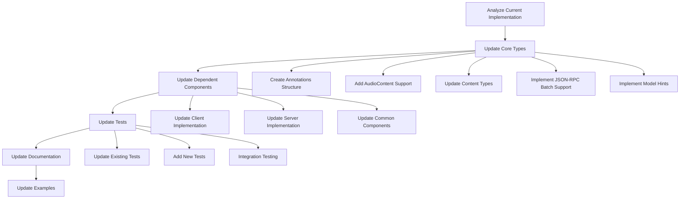

# Update Plan for Qt MCP Implementation

## 1. Key Changes in the 2025-03-26 Schema

Based on analysis of both schema files, here are the key differences that need to be addressed:

### 1.1. Audio Content Support
- New `AudioContent` type added
- `AudioContent` included as a possible content type in:
  - `CallToolResult`
  - `CreateMessageResult`
  - `PromptMessage`
  - `SamplingMessage`

### 1.2. Annotations Structure Change
- `Annotated` base type replaced with direct references to `Annotations`
- All objects that previously inherited from `Annotated` now have an explicit `annotations` property

### 1.3. JSON-RPC Batch Support
- New types added:
  - `JSONRPCBatchRequest`
  - `JSONRPCBatchResponse`
- `JSONRPCMessage` updated to include batch operations

### 1.4. Model Hints
- New `ModelHint` type added
- `ModelPreferences` updated to include hints

### 1.5. Other Changes
- Various minor updates to existing types
- Possible removal of `ListResourceTemplatesRequest` from `ClientRequest`

## 2. Implementation Plan

### 2.1. Code Analysis Phase

1. **Analyze Current Implementation**
   - Review how the current implementation maps to the 2024-11-05 schema
   - Identify all classes that will need to be updated
   - Understand the inheritance structure, especially for `Annotated`

2. **Dependency Analysis**
   - Identify dependencies between components
   - Create a dependency graph to determine the order of updates

### 2.2. Implementation Phase

#### 2.2.1. Update Core Types

1. **Create Annotations Structure**
   - Create/update `qmcpannotations.h` to implement the new Annotations structure
   - Update or deprecate the existing `qmcpannotated.h`

2. **Add AudioContent Support**
   - Create new `qmcpaudiocontent.h` file
   - Implement the AudioContent class with required properties

3. **Update Content Types**
   - Update `qmcptextcontent.h`, `qmcpimagecontent.h` to use the new Annotations reference
   - Update content containers to include AudioContent:
     - `qmcpcalltoolresultcontent.h`
     - `qmcpcreatemessageresultcontent.h`
     - `qmcppromptmessagecontent.h`
     - `qmcpsamplingmessagecontent.h`

4. **Implement JSON-RPC Batch Support**
   - Create new files:
     - `qmcpjsonrpcbatchrequest.h`
     - `qmcpjsonrpcbatchresponse.h`
   - Update `qmcpjsonrpcmessage.h` to include batch operations

5. **Implement Model Hints**
   - Create new `qmcpmodelhint.h` file
   - Update `qmcpmodelpreferences.h` to include hints

#### 2.2.2. Update Dependent Components

1. **Update Client Implementation**
   - Update client code to handle new message types
   - Update client capabilities

2. **Update Server Implementation**
   - Update server code to handle new message types
   - Update server capabilities

3. **Update Common Components**
   - Update any shared components that depend on the modified types

### 2.3. Testing Phase

1. **Update Existing Tests**
   - Update tests to reflect changes in the API
   - Ensure all existing functionality still works

2. **Add New Tests**
   - Add tests for new features:
     - AudioContent
     - JSON-RPC Batch operations
     - Model Hints

3. **Integration Testing**
   - Test client-server communication with the updated protocol
   - Test with example applications

### 2.4. Documentation Phase

1. **Update API Documentation**
   - Document new classes and methods
   - Update existing documentation to reflect changes

2. **Update Examples**
   - Update example code to demonstrate new features
   - Add new examples specifically for new features

## 3. File Changes

Here's a list of files that will likely need to be modified or created:

### 3.1. New Files
- `src/mcpcommon/qmcpaudiocontent.h`
- `src/mcpcommon/qmcpaudiocontent.cpp`
- `src/mcpcommon/qmcpjsonrpcbatchrequest.h`
- `src/mcpcommon/qmcpjsonrpcbatchresponse.h`
- `src/mcpcommon/qmcpmodelhint.h`
- `src/mcpcommon/qmcpmodelhint.cpp`

### 3.2. Modified Files
- `src/mcpcommon/qmcpannotations.h`
- `src/mcpcommon/qmcpannotated.h` (possibly deprecated)
- `src/mcpcommon/qmcptextcontent.h`
- `src/mcpcommon/qmcpimagecontent.h`
- `src/mcpcommon/qmcpcalltoolresult.h`
- `src/mcpcommon/qmcpcalltoolresultcontent.h`
- `src/mcpcommon/qmcpcreatemessageresult.h`
- `src/mcpcommon/qmcpcreatemessageresultcontent.h`
- `src/mcpcommon/qmcppromptmessage.h`
- `src/mcpcommon/qmcppromptmessagecontent.h`
- `src/mcpcommon/qmcpsamplingmessage.h`
- `src/mcpcommon/qmcpsamplingmessagecontent.h`
- `src/mcpcommon/qmcpjsonrpcmessage.h`
- `src/mcpcommon/qmcpmodelpreferences.h`
- `src/mcpcommon/qmcpclientrequest.h`
- `src/mcpclient/qmcpclient.cpp`
- `src/mcpclient/qmcpclient.h`
- `src/mcpserver/qmcpserver.cpp`
- `src/mcpserver/qmcpserver.h`
- Various test files in `tests/auto/`

## 4. Implementation Strategy

## 5. Timeline

Given the scope of changes, here's a proposed timeline:

1. **Week 1**: Code Analysis and Planning
   - Detailed analysis of current implementation
   - Finalize implementation plan
   - Set up test environment

2. **Week 2-3**: Core Implementation
   - Implement core type changes
   - Update dependent components
   - Initial testing

3. **Week 4**: Testing and Documentation
   - Complete test suite updates
   - Update documentation
   - Update examples

4. **Week 5**: Final Testing and Release
   - Integration testing
   - Address any issues found
   - Prepare for release

## 6. Risks and Mitigation

1. **API Compatibility**
   - **Risk**: Changes to core types might break existing code
   - **Mitigation**: Maintain backward compatibility where possible, provide clear migration guides

2. **Performance Impact**
   - **Risk**: New features might impact performance
   - **Mitigation**: Benchmark before and after changes, optimize if necessary

3. **Testing Coverage**
   - **Risk**: Incomplete testing might miss issues
   - **Mitigation**: Ensure comprehensive test coverage, especially for new features

4. **Integration Issues**
   - **Risk**: Updated client might not work with older servers and vice versa
   - **Mitigation**: Implement version negotiation, test with mixed versions