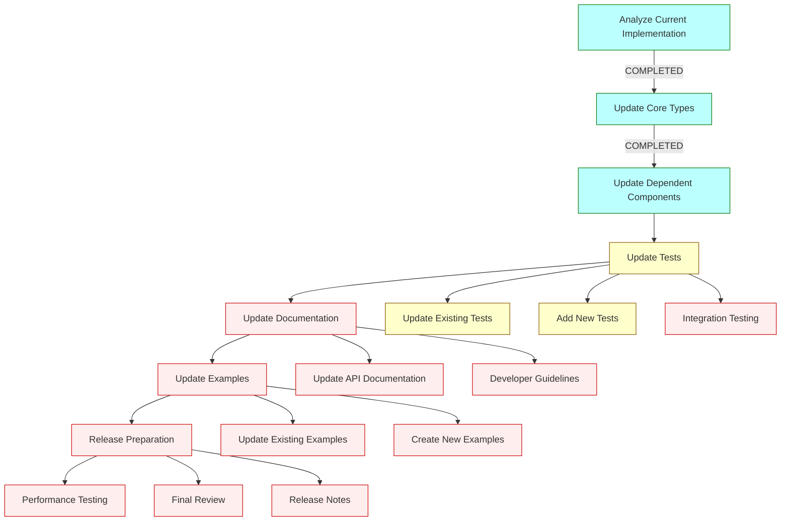

# Updated Implementation Plan for Qt MCP 2025-03-26

## 1. Implementation Status

### 1.1. Completed Tasks

#### 1.1.1. Code Analysis Phase ✅ COMPLETE
- Analyzed current implementation mapping to 2024-11-05 schema
- Identified classes needing updates
- Understood inheritance structure for QMcpAnnotated

#### 1.1.2. Core Implementation Phase ✅ COMPLETE

1. **Audio Content Support** ✅ COMPLETE
   - Created and implemented `qmcpaudiocontent.h`
   - Audio content support added to all content containers:
     - `qmcpcalltoolresultcontent.h`
     - `qmcpcreatemessageresultcontent.h`
     - `qmcppromptmessagecontent.h`
     - `qmcpsamplingmessagecontent.h` - Added constructors for text, image, and audio content

2. **Annotations Structure Change** ✅ COMPLETE
   - Added direct annotations properties to all classes
   - Maintained QMcpAnnotated for backward compatibility with 2024-11-05 schema servers

3. **JSON-RPC Batch Support** ✅ COMPLETE
   - Created new files:
     - `qmcpjsonrpcbatchrequest.h`
     - `qmcpjsonrpcbatchresponse.h`
   - Updated `qmcpjsonrpcmessage.h` documentation to include batch operations

4. **Model Hints** ✅ COMPLETE
   - Created `qmcpmodelhint.h` with name property
   - Updated `qmcpmodelpreferences.h` to include hints

5. **Other Changes** ✅ COMPLETE
   - Maintained `ListResourceTemplatesRequest` in `ClientRequest` for backward compatibility

#### 1.1.3. Dependent Components Update ✅ COMPLETE
- Client and server implementations updated to handle new message types
- Updated capabilities for both client and server
- Shared components updated to work with modified types

### 1.2. Remaining Tasks

#### 1.2.1. Testing Phase

1. **Update Existing Tests** ⏳ IN PROGRESS
   - Update tests to reflect changes in the API
   - Ensure all existing functionality still works with both schema versions
   - Estimated completion: 1 week

2. **Add New Tests** ⏳ IN PROGRESS
   - Add tests for new features:
     - AudioContent functionality
     - JSON-RPC Batch operations
     - Model Hints usage
   - Estimated completion: 1 week

3. **Integration Testing** 🔜 PLANNED
   - Test client-server communication with the updated protocol
   - Test with MCP servers supporting both schema versions (2024-11-05 and 2025-03-26)
   - Test with example applications
   - Estimated completion: 1-2 weeks

#### 1.2.2. Documentation Phase 🔜 PLANNED

1. **Update API Documentation**
   - Document all new classes and methods
   - Update existing documentation to reflect changes
   - Highlight backward compatibility considerations
   - Estimated completion: 1 week

2. **Developer Guidelines**
   - Create guidelines for developers on how to use the new features
   - Provide migration path for applications using the older API
   - Estimated completion: 3-5 days

#### 1.2.3. Example Updates 🔜 PLANNED

1. **Update Existing Examples**
   - Modify existing examples to use new features where appropriate
   - Ensure all examples still work with the updated implementation
   - Estimated completion: 3-5 days

2. **Create New Examples**
   - Add examples demonstrating:
     - Audio content handling
     - JSON-RPC batch operations
     - Model hint usage
   - Estimated completion: 1 week

## 2. Updated Implementation Strategy

## 3. Revised Timeline

1. ~~**Week 1-3**: Code Analysis and Implementation~~ ✅ COMPLETED
   - ~~Detailed analysis of current implementation~~
   - ~~Implement core type changes~~
   - ~~Update dependent components~~

2. **Week 4-5**: Testing (Current Phase)
   - Complete test suite updates
   - Add tests for new features
   - Begin integration testing

3. **Week 6**: Documentation and Examples
   - Update API documentation
   - Create developer guidelines
   - Update and create examples

4. **Week 7**: Final Testing and Release
   - Complete integration testing
   - Performance testing
   - Final review and release notes

## 4. Backward Compatibility Strategy

To ensure compatibility with both 2024-11-05 and 2025-03-26 schema versions:

1. **Dual-Structure Support**
   - Maintain QMcpAnnotated while also supporting direct annotations properties
   - Support both old and new content type mechanisms

2. **Version Detection**
   - Client should detect server schema version during initialization
   - Use appropriate message formats based on detected version

3. **Graceful Degradation**
   - When communicating with older servers, exclude new features like audio content
   - When receiving data with new features from newer servers, handle it appropriately if possible

## 5. Testing Focus Areas

1. **Cross-Version Communication**
   - Test communication between clients and servers with different schema versions
   - Verify graceful handling of unsupported features

2. **New Feature Verification**
   - Thorough testing of audio content handling
   - Batch request processing
   - Model hint interpretation

3. **Performance Impact**
   - Benchmark performance with both schema versions
   - Ensure no significant degradation with either version

## 6. Remaining Risks and Mitigation

1. **Integration Issues**
   - **Risk**: Unforeseen issues when different versions interact
   - **Mitigation**: Extensive cross-version testing

2. **User Adoption**
   - **Risk**: Developers confused by dual support mechanisms
   - **Mitigation**: Clear documentation and migration guides

3. **Feature Discoverability**
   - **Risk**: New features may be difficult to discover or use correctly
   - **Mitigation**: Comprehensive examples and improved documentation